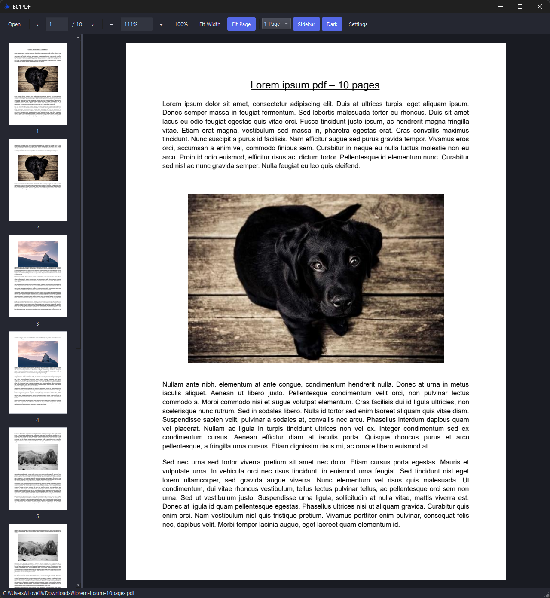

# B01PDF

A minimal Windows desktop PDF viewer focused on comfortable reading, simple navigation, and flexible view controls.

[Download the latest version](https://github.com/BE0X01/b01-pdf/releases/latest) · [All releases](https://github.com/BE0X01/b01-pdf/releases) · [Report an issue](https://github.com/BE0X01/b01-pdf/issues)

## Preview

## Installation

1. Download `B01PDF-<version>-Windows-Setup.zip` from the latest release.
2. Extract the ZIP and run `B01PDF-Setup.exe`.
3. Launch B01PDF and select the folder icon (`Open`), or drag a PDF into the window.

Python is not required. The default installation directory is `Program Files\B01PDF`. Installation requires administrator permission. All application text is in English.

## Features

| Feature | Description |
| --- | --- |
| Fit modes | `Fit Width` and `Fit Page` have active button indicators and automatically adjust when the window resizes. |
| Zoom | Restore 100%, use preset zoom steps, or adjust with Ctrl+mouse wheel. Manual zoom exits the active fit mode. |
| View modes | Choose `1 Page`, `2 Pages`, or continuous `Scroll`. Two-page view displays pairs such as 1-2 and 3-4. |
| Thumbnail sidebar | Navigate using page previews. Thumbnails scale with the sidebar width; the far-left sidebar icon toggles its visibility (outline when hidden, filled when visible). |
| Typography | Malgun Gothic throughout the interface, using the font installed with Windows. |
| Scrollbars | Slim, rounded handles with flat tracks in both themes. |
| Themes | Click the single moon/sun button at the far right to toggle between dark and light themes. |
| Image filters | Select `Original` or `Sharp` in Settings. Filters affect the display without modifying the PDF. |
| Saved preferences | Zoom, fit mode, view mode, theme, sidebar visibility, filter, and shortcuts are saved globally. |
| Reading position | Optionally remember the last page and scroll position for each file. |
| File opening | Supports password-protected PDFs, drag and drop, command-line file opening, and double-clicking the empty viewer to open a PDF. |

The sidebar width has a 160px minimum. Its maximum is the smaller of 20% of the window width and 220px: an 800px window allows 160px, and a 1500px window allows 220px. The window has an 800px minimum width.

## Navigation and Panning

- In single-page and two-page views, the mouse wheel scrolls an oversized page vertically. At the bottom, another downward wheel step advances. At the top, an upward step returns to the bottom of the previous page.
- Two-page view advances or returns by one pair of pages.
- `Shift+mouse wheel` scrolls horizontally without changing pages.
- Drag with the left mouse button to pan an enlarged page.
- Continuous Scroll view scrolls through the entire document.

## Default Keyboard Shortcuts

Change shortcuts in `Settings`, save your changes, or restore the defaults. Conflicting shortcuts are reported before saving.

| Action | Default shortcut |
| --- | --- |
| Open PDF | `Ctrl+O` |
| Open Settings | `Ctrl+,` |
| Fit Page | `Ctrl+0` |
| Fit Width | `Ctrl+9` |
| Zoom to 100% | `Ctrl+1` |
| Zoom to 200% | `Ctrl+2` |
| Zoom to 300% | `Ctrl+3` |
| Zoom to 50% | `` Ctrl+` `` |
| Zoom in by one preset | `Ctrl++` (`Ctrl+=` is also supported) |
| Zoom out by one preset | `Ctrl+-` |
| Single-page view | `Alt+1` |
| Two-page view | `Alt+2` |
| Continuous Scroll view | `Alt+3` |
| Toggle sidebar | `F9` |
| Open quit confirmation | `Ctrl+Q` |

Use `Down`, `Right`, or `Page Down` for the next page; `Up`, `Left`, or `Page Up` for the previous page. `Home` jumps to the first page and `End` to the last page. These navigation keys are fixed and cannot be assigned to other actions. Editable controls retain their standard editing behavior.

### Zoom Behavior

The toolbar −/+ buttons and `Ctrl+-` / `Ctrl++` use these preset levels:

`10% → 25% → 33% → 50% → 75% → 100% → 150% → 200% → 300%`

Zooming out at 10% or in at 300% does nothing. If the current zoom falls between presets, the next action selects the nearest preset in that direction.

`Ctrl+mouse wheel` changes zoom in 10-percentage-point steps, within a range of 10-400%.

`Ctrl+Q` displays a quit confirmation with `OK` and `Cancel`. Closing with the window's X button exits directly.

## Settings Storage

Preferences and per-file reading positions are stored in `settings.ini` beside `B01PDF.exe`. With the default installation, this is `C:\Program Files\B01PDF\settings.ini`. Changes stay in memory during use and are written once when B01PDF exits normally, including when it closes for an update. A forced termination or power loss loses changes from that session. One-time legacy migration saves immediately before removing old storage. You can back up this file while B01PDF is closed. PDF contents are not stored in it. The file belongs to the installation, so Windows users of that installation share its preferences and reading positions.

On the first launch after upgrading, existing preferences and reading positions from `%LOCALAPPDATA%\B01PDF\settings.ini` are migrated automatically. Values already present beside the executable take priority. The old file is removed only after the new file is saved successfully. Direct upgrades from registry-based versions are also supported. Subsequent launches use only the file beside the executable.

The installer grants normal users write access to `settings.ini` while keeping the executable and installation folder protected. Updates preserve the file. Running from a portable folder uses the same location beside the executable; that folder must allow saving settings. A permissions error is reported instead of silently falling back to LocalAppData.

Deleting a PDF does not automatically remove its saved reading position. Turning off reading-position memory clears all saved positions while preserving application preferences.

## Updates

Select `Settings` → `Check for Updates` to check the latest stable GitHub release. When a newer version is available, confirm the download. B01PDF downloads the installer ZIP, verifies its SHA-256 checksum, and starts the installer. The viewer closes so its files can be replaced. Existing settings are preserved. After the installer exits, its EXE and temporary folder are automatically removed. Abandoned update folders older than 24 hours are also cleaned on startup; files still in use are retried on a later launch.

Checking for and downloading updates requires internet access. Reading PDFs does not. The updater does not send PDF contents or file paths.

Version 0.1 has no built-in updater. If automatic installation does not work in an older version, download and run the latest installer manually. If an older per-user installation remains, verify that the new installation works before removing it.

## License

See [LICENSE](LICENSE) for the project license and [THIRD_PARTY.md](THIRD_PARTY.md) for dependency notices.
